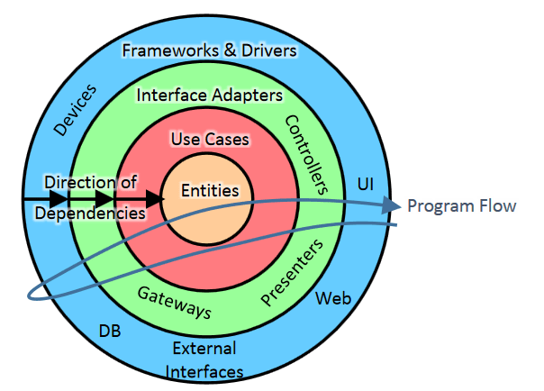

<h1 align="center"> API de users </h1>
<p>
  Prueba tecnica backend Node.js
</p>

## Pensamientos

Primero que todo quiero explicar mi proceso de pensamiento el cual fue completamente basado (aunque no en su totalidad) en lo aprendido en leer el libro del bastante conocido "Uncle bob" llamado Clean Architecture y por supuesto los principios del DDD (Domain-Driven-Design), Al principio considere esta solucion algo ariesgada de implementar ya que toma un tiempo considerable de energia en planificar lo que se va a estructurar en el codigo, pero apesar de todo me siento muy orgulloso con el resultado, trata de enfocarme mas en la escalabilidad del proyecto y que basicamente fuera Framework-Agnostic, y tambien en la calidad de los test tanto Unit-tests como Integration-tests.

## Filosofia

la filosofia detras de esta solucion es tener un proyecto que sea altamente mantenible e extensible en el tiempo mientras las funcionalidades van creciendo, y por supuesto seguir los aspectos mas importantes de los principios SOLID.

## architecture



## Instalacion

debes tener instalado [node.js](https://nodejs.org/en/) para poder ejecutar el proyecto.

## Como correr el proyecto

### clona el repositorio

```bash
  git clone https://github.com/JorgeDuranAlcala/prueba-tecnica-backend.git
```

### variables de entorno (OPCIONAL)

opcionalmente puedes crear un archivo .env en el cual agregar la variables de entorno como la version de la api

```bash
  API_VERSION=1
```

### importante

Las rutas cambiaran dependiendo si decidiste añadir el archivo .env, si no añadiste la variable API_VERSION en el .env, la ruta sera del siguiente modo por defecto:

```bash
[domain-name | http://localhost:4000]/api/vbeta/
```

### install dependencies

```bash
npm install
```

## Inicializacion

```bash
  npm run start:dev
```
## API Documentation 

```bash
[domain-name | http://localhost:4000]/api-docs
```

## production

```bash
  npm run start
```

## Correr tests

```bash
  npm run test
```


## External dependencies

- compression
- jest
- supertest
- uuid
- cross-env
- class-transformer
- class-validator
- express
- ts-node
- helmet
- reflect-metadata
- ts-node

## Usage

##### importante

```bash
/POST "[domain-name]/api/vbeta/users",
```

#### Body format

```javascript
{
				nombre: "Jorge",
				segundo_nombre: "Luis",
				apellido_paterno: "Duran",
				apellido_materno: "Alcala",
				fecha_de_nacimiento: "20 junio 2001",
				email: "jorgeluis20.duran@gmail.com",
				telefono: "+584267472629",
}
```
